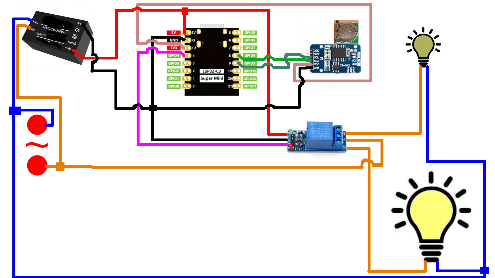

# Night-Mode-Lamp
The aim of the project is to convert an already existing lamp (saying, in the WC) to the one which doesn't blind you at night and is fully bright during daytime.

# Why?
Ever tried to go to the WC at night and being blinded by the lights there when turned on and afterwards have issues falling asleep? This might be the project to fix that issue

# Hardware
The schematics looks like this (image below):

List of parts needed:
* 1 x [ESP32 C3 Super Mini](https://www.aliexpress.com/w/wholesale-esp32-c3-super-mini.html?spm=a2g0o.home.search.0) (or [similar](https://botland.store/esp32-wifi-and-bt-modules/23869-esp32-c3-zero-mini-development-board-with-soldered-connections-esp32-c3fn4-waveshare-25452.html)).
  > **Important!!!!** Not all ESP32 C3's pinout is the same - please double or even better triple check the pin numbers!
* Wires
* 1 x RTC_DS3231 module (!!WITH A BATTERY SOCKET AND A BATTERY!!)
* 1 x 5V Relay module
* 1 x AC to 5V module
* two lamps - one bight and one not that much - with sockets
* common sense - as this project involves working with AC - if you aren't familiar with how to deal with AC ask help from someone who is as AC power is dangerous. You have been warned.

Connect according to schematics and isolate all the exposed connections with electric tape

# Software

* The ["ino" file](esp32_lamp_controller.ino) in the repo - use Arduino IDE (I used v. 2.3.2 on Linux for reference).
* "RTClib" library installed from Arduino IDE
* "Wire" library installed from Arduino IDE
* "OTA" library - create a folder "ESP32-OTA" inside the Arduino "libraries" folder, put there the ["OTA.h" file](OTA.h) and ["wifi-credentials.h.orig" file](wifi-credentials.h.orig); then rename wifi-credentials.h.orig to wifi-credentials.h and adjust contents of the file to Your wifi network (2.4GHz one). This is for the OTA to work properly later when You'd like to update the project remotely.

# Make it work

Compile, upload to ESP32 - place inside your lamp and that's pretty much it.

# Tips
* Settings for ESP32 in Arduino IDE:
* * USB CDC on boot: enabled
  * CPU frequency: 160 MHz (Wifi)
  * Core Debug Level: info
  * Erase all flash before Sketch Upload: disabled
  * Flash Frequency: 80 MHz
  * Flash Mode: QIO
  * Flash Fize: 4Mb (32Mb)
  * JTag Adapter: Disabled
  * Partition Scheme: Minimal SPIFFS (1.9Mb APP with OTA/190KB SPIFFS)
  * Upload Speed: 921600
  * Zigbee mode: disabled

